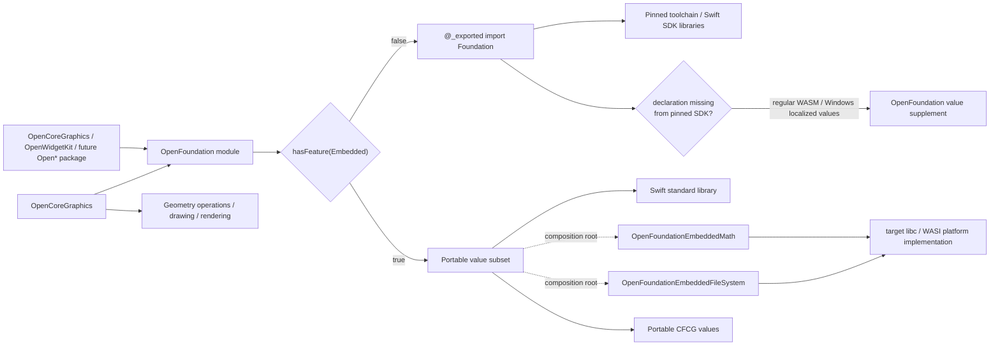
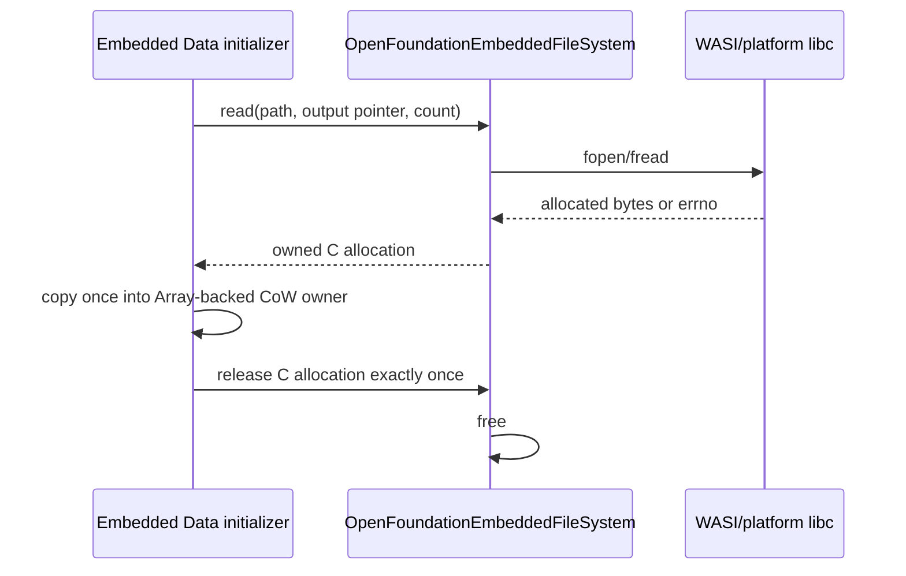

# OpenFoundation Design

## Confirmed current facts

- 固定対象の通常WASM Swift SDKには`Foundation`、`FoundationEssentials`、関連libraryがある。
- 固定対象の通常WASM Swift SDKとWindows toolchainのFoundationには
  `String.LocalizationValue`、`LocalizedStringResource`、
  `CustomLocalizedStringResourceConvertible`が存在しない。
- 同じSDK bundleのEmbedded WASM resource pathにはFoundation moduleがない。
- 同じEmbedded WASM resource pathの`Swift.swiftmodule`には`AnyHashable`宣言があるが、型、
  initializer、`Equatable` conformanceは`@_unavailableInEmbedded`であり使用できない。
- 従来の`OpenCoreGraphicsSupport`は、CFCG値型とFoundation境界を二重化していたが、現行package
  graphから除去されている。
- Apple SDKではCFCG値型がCoreFoundation/Foundation import surfaceから見え、非Darwin Foundationも
  `CGFloat`、`CGPoint`、`CGSize`、`CGRect`、`CGRectEdge`を提供する。一方、非Darwin Foundationには
  `CGVector`とaffine transform familyがないため、OpenFoundationが同じportable value familyとして
  補完する。
- OpenCoreGraphicsのfont、PDF、data provider/consumer経路が、portable `Data`、`URL`、`Date`、
  string encoding、math関数を実際に使用している。
- OpenWidgetKitのWindows公開APIはtoolchain Foundationの型identityを必要とする。

これらはpackage graph、実装source、呼び出し元、既存test source、OpenCoreGraphicsの変更履歴、
固定Swift SDK内のmodule配置、および2026-08-20のNative/通常WASM/Embedded WASM検証から確認した事実です。

## Required invariants

1. full Swiftではtoolchain/SDK組み込みFoundationの既存型identityを変えない。固定SDKに宣言が存在しない
   valueだけをOpenFoundationが同じimport境界で補完する。
2. EmbeddedではFoundation、FoundationEssentials、FoundationInternationalizationをimport/linkしない。
3. `swift-foundation`をSwiftPM dependencyとして追加しない。
4. CFCG値型の宣言とworkspace-wide identityはOpenFoundationが所有し、OpenCoreGraphicsはgraphics
   operation、drawing、rendering semanticsだけを所有する。
5. platform差はOpenFoundationのcomposition boundaryに閉じ込める。
6. unsupported operationを空値や偽の成功へ丸めず、`nil`またはtyped errorで返す。
7. C bufferのowner、copy boundary、exactly-once releaseを維持する。
8. compiler、Swift SDK、Foundation runtimeを同一snapshotに固定する。
9. Swift標準libraryが所有する型をOpenFoundationで同名再定義しない。

## Ideal architecture



### Type ownership

| Type family | full Swift owner | Embedded owner | Reason |
|---|---|---|---|
| `Data`, `URL`, `Date`, `TimeInterval` | toolchain Foundation | OpenFoundation | Foundation-compatible portable values |
| `String.Encoding` conversion subset | toolchain Foundation | OpenFoundation | byte/text boundary used across packages |
| `NSAttributedString` | toolchain Foundation | OpenFoundation, incomplete plain-string subset | shared metadata/text compatibility |
| `AnyHashable` | Swift standard library | OpenFoundation, incomplete scalar-key subset | 固定Embedded SDKはSwift.AnyHashableを明示的にunavailableにする |
| math global functions | toolchain Foundation exposure | OpenFoundation API + selected Embedded math backend | shared numeric source without libc imports or an unconditional backend in consumers |
| file `Data` read/write | toolchain Foundation | OpenFoundation API + selected Embedded file-system backend | file access is a platform capability, not a portable value dependency |
| `CGFloat`, `CGPoint`, `CGSize`, `CGRect`, `CGRectEdge` | toolchain Foundation identity | OpenFoundation | one import boundary and architecture-correct scalar ABI |
| `CGVector`, `CGAffineTransform`, `CGAffineTransformComponents` | toolchain Foundation identity where available; otherwise OpenFoundation | OpenFoundation | one portable CFCG value family without a renderer dependency |
| `String.LocalizationValue`, `LocalizedStringResource` | toolchain Foundation where available; OpenFoundation on regular WASM and Windows where the fixed SDK/toolchain lacks the declarations | not declared | AppIntents/SwiftUI resource metadata remains a value until the selected rendering boundary |
| geometry operations, paths, contexts, colors, drawing | OpenCoreGraphics | OpenCoreGraphics | graphics behavior is separate from value identity |
| `Bundle`, locale, calendar, formatter, JSON coding | toolchain Foundation | not declared | not required by the current Embedded execution path |

### Import contract

```text
Shared Open package source
    -> import/re-export OpenFoundation
        -> full Swift: official Foundation identity
        -> Embedded: portable subset only
```

Consumer packages do not select `Foundation` versus `FoundationEssentials`. They depend on
OpenFoundation and let this package select the implementation once. Apple-only platform adapters may import
system frameworks directly when bridging a system API; those imports must not enter portable shared targets.

## Data flow and ownership



`Data`のsteady-state storageはSwift `Array<UInt8>`であり、値copyはArrayのCoW契約に従います。
C allocationはfile boundaryを越えて保持しません。remote URL loadingは実装せず、
`DataIOError.unsupportedURL`として失敗させます。file I/OはabsoluteかつNUL-freeのfilesystem pathに
限定し、relative pathは`DataIOError.unsupportedFilePath`としてC境界へ到達する前に失敗させます。

`OpenFoundation` targetはC targetへ依存しません。Embedded用のmathとfile-system hookは安定した
C ABIとして宣言し、最終executableが必要なcapability productだけをlinkします。これによりfull Swiftの
expanded dependency graphからEmbedded backendを除外し、Embeddedでもmathだけを必要とするruntimeが
file I/Oを引き込む逆流を防ぎます。backendを選択しないまま対応APIを使用したdeploymentはlink contract
違反であり、composition validationで検出します。

Swift側のhook宣言には`@_extern(c, ...)`を使用し、`OpenFoundation` targetで`Extern` experimental
featureを有効にします。固定Embedded snapshotでは`@_silgen_name`だけではC calling conventionが保証
されず、C実装とSwift呼び出し側のABIが一致しません。C ABIはhookの所有packageで明示し、consumerや
上位frameworkでcast、wrapper、target分岐を追加して補償しません。

## FoundationEssentials decision

full Swiftで`FoundationEssentials`を直接採用すると、公開APIが必要とするFoundation umbrella、
geometry、Bundle/resource behaviorとの差を各consumerへ漏らします。同じprocessが最終的に
Foundationをlinkする場合、size削減にもなりません。そのためfull SwiftはFoundation umbrellaに
固定します。

EmbeddedではEssentialsへ置換しません。Foundation familyを依存グラフから除外し、必要な値だけを
OpenFoundationが所有します。binary size効果は推測せず、次の同一条件比較で判断します。

```text
Embedded application + OpenFoundation portable subset
    versus
same application + full Foundation-capable WASM SDK
```

比較ではtoolchain commit、SDK snapshot、target triple、optimization、LTO、strip、application sourceを
固定し、final wasm bytesとsymbol contributionを記録します。

## Error and compatibility contract

| Operation | Supported behavior | Unsupported behavior |
|---|---|---|
| file `Data` read/write | absolute、NUL-free pathとerrnoを保持した`DataIOError` | remote URLは`unsupportedURL`、relative pathは`unsupportedFilePath` |
| string decode/encode | documented five encodings | `nil` |
| URL construction | authorityなしのlocal absolute file URL、percent-encoded UTF-8 path、absolute serialized URL subset | file authority、raw query/fragment、invalid percent encodingは`nil` |
| attributed text | immutable plain string | attributesは未完成markerで明示 |
| regular WASM localized resource | literal/interpolation metadata、Codable、explicit `.atURL` table lookup、sequential/positional string replacement、default-value rendering | executable `.main`/`.forClass` bundle discovery is unavailable; `.forClass` encoding throws because class identity cannot be restored |

同名型の存在だけでFoundation全体とのsemantic parityを主張しません。APIが未宣言の領域はprogress
document、呼び出し可能だが部分的な領域はsourceの`FIXME(INCOMPLETE_IMPLEMENTATION)`で管理します。

## Concurrency and lifetime

現在のportable型はimmutable value、Array-backed CoW value、またはimmutable final classです。
package-owned shared mutable stateはありません。将来cache、clock、resource registryを追加する場合は、
Native/WASM/Embeddedで同じ`Mutex<State>`またはactor契約を使用し、Embeddedだけraw stateへ分岐させません。

## Adoption sequence

1. OpenFoundation package、portable implementation、CFCG value identityを確立する。
2. OpenCoreGraphicsから重複value targetを除去し、OpenFoundationを直接re-exportする。
3. OpenWidgetKitのFoundation/CFCG import surfaceをOpenFoundationへ接続する。
4. 各Open packageの直接Foundation importを、実行経路とAPI必要量を確認しながら個別に移行する。
5. Native、通常WASM、Embedded WASM、Windowsのcompile/link/runtimeとsizeを検証する。
6. full Swiftのexpanded target graphにEmbedded backendがなく、Embedded executableが要求した
   capability backendだけを含むことを検証する。

手順1から4はactive runtime graphで完了し、Windows以外のCFCG境界で検証済みです。共有sourceで
Foundation-compatible valueを公開するtargetはOpenFoundationへ直接依存し、OpenAVFoundationDriverの
ように標準libraryとmedia契約だけで完結するtargetは依存を追加しません。Apple camera driverの
Foundation/CoreFoundation importはnative adapter境界に残し、deprecatedでruntime graphから切断済みの
OpenUSDKitはmigration historyとして変更しません。手順5はWindowsだけが未検証で、手順6は
expanded targetとlink symbol graphで検証済みです。今後FoundationのTimer、RunLoop、Bundle、JSON、
localeなどを追加する場合も、portable subsetで意味を保てるか、platform adapterへ残すべきかを
呼び出し経路ごとに判断します。

## Unresolved items

- Windowsの固定toolchain/SDK baselineと実際のDLL/static link graph。
- browser-hosted deploymentのfilesystem policy。WASIのpreopened directoryを使うfile runtimeは検証済み。
- portable `NSAttributedString`のattribute-run model。
- 追加するFoundation-compatible APIの優先順位。
- Windowsでの同一fixtureによるDLL/static linkと配布物サイズ。

これらはsource boundaryの作成を妨げませんが、release readyまたはFoundation問題の完全解決を
主張する前に検証が必要です。
