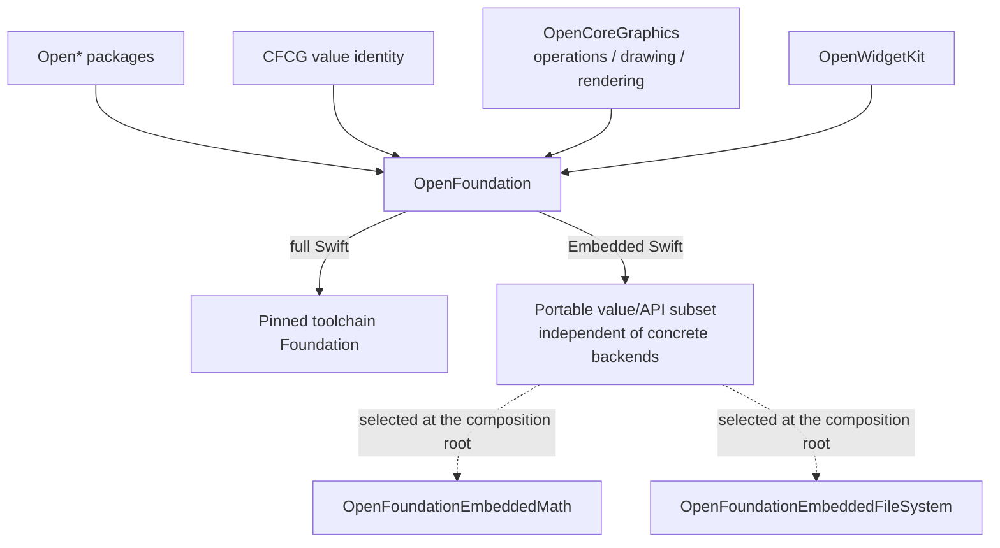

# OpenFoundation

OpenFoundation is the shared boundary through which the `Open*` packages in the
CoreFoundation workspace access Foundation-compatible APIs. It is not a fork of
Foundation. On full Swift it re-exports the official Foundation module, while on
Embedded Swift it implements only an explicitly documented portable subset.

## Policy

| Swift mode | `OpenFoundation` behavior | Type identity | Foundation link |
|---|---|---|---|
| macOS / Linux | Re-exports the toolchain-provided `Foundation` module | Identical to toolchain Foundation | Yes |
| Windows | Re-exports the toolchain-provided `Foundation` module and supplements the localized-string value family missing from the pinned toolchain | Toolchain identity for existing declarations; OpenFoundation identity only for missing declarations | Yes |
| Regular WASM | Re-exports the Swift SDK-provided `Foundation` module and supplements the localized-string value family missing from the pinned SDK | SDK identity for existing declarations; OpenFoundation identity only for missing declarations | Yes |
| Embedded WASM | Provides the minimum required portable value implementations | OpenFoundation owns Foundation-compatible values; Swift types remain standard-library types | No |

On regular Swift targets, OpenFoundation does not declare replacements for
types already supplied by Foundation. It performs `@_exported import Foundation`,
so full Swift targets use the official Foundation type identities and
implementations unchanged where those declarations exist. The pinned regular
WASM SDK and Windows toolchain do not
declare `String.LocalizationValue`, `LocalizedStringResource`, or
`CustomLocalizedStringResourceConvertible`; OpenFoundation supplies that value
family on those platforms. It preserves keys, default values, interpolation
replacements, tables, locale metadata, bundle descriptions, equality, coding,
and rendering through an explicit bundle. A supplemental `.main` or `.forClass`
bundle with no recoverable resource location renders the default value. Encoding
`.forClass` fails explicitly because the supplemental implementation cannot
restore `AnyClass` identity after decoding.

Embedded Swift does not import or link the Foundation module. The current
portable surface contains the `Data`, `URL`, `Date`, and `TimeInterval` APIs
required by existing Open framework execution paths, the CFCG value types, a
limited `String.Encoding` surface, a plain-string `NSAttributedString`, and math
functions. The pinned Embedded SDK explicitly marks `Swift.AnyHashable` as
unavailable, so OpenFoundation currently provides the scalar-key subset needed
by Open framework metadata paths as an explicitly incomplete contract.

## Ownership



OpenFoundation owns the single value identity for `CGFloat`, `CGPoint`,
`CGSize`, `CGRect`, `CGRectEdge`, `CGVector`, `CGAffineTransform`, and
`CGAffineTransformComponents`. On full Swift it re-exports the toolchain
Foundation declarations without shadow aliases and supplements only types that
are missing from non-Darwin Foundation. On Embedded Swift it supplies portable
declarations. OpenCoreGraphics re-exports the same types and owns their
operations, paths, contexts, drawing APIs, and renderers.

## FoundationEssentials

OpenFoundation does not import `FoundationEssentials` directly. The public
compatibility boundary for full Swift is fixed to the `Foundation` umbrella
module. The compiler, Foundation, FoundationEssentials,
FoundationInternationalization, and runtime must come from the same toolchain
or Swift SDK.

Embedded size reduction is achieved by removing the Foundation module from the
dependency graph, not by substituting FoundationEssentials. Size claims are
based only on binaries built with identical toolchain and optimization settings.
With the pinned Swift 6.4 snapshot on 2026-08-20, the same release geometry
fixture measured 60,439,915 bytes for regular WASM and 307,745 bytes for
Embedded WASM. The Embedded link symbols contain no FoundationEssentials,
FoundationInternationalization, or CoreFoundation implementation, and the
geometry-only graph selects neither the math nor the file-system backend.

## Package layout

| Target | Role |
|---|---|
| `OpenFoundation` | Re-exports Foundation on full Swift, supplies declarations missing from the pinned regular WASM SDK and Windows toolchain, and supplies the Embedded portable value/API subset without depending on a concrete backend |
| `OpenFoundationEmbeddedMath` | Capability-specific implementation of the Embedded math hooks |
| `OpenFoundationEmbeddedFileSystem` | Capability-specific implementation of the Embedded file read/write hooks |
| `OpenFoundationToolchainIdentity` | Test helper that imports Foundation directly and verifies compile-time identity with the re-exported types |
| `OpenFoundationTests` | Fixtures for the full Swift re-export and toolchain Foundation type identity, including `LocalizedStringResource` on Apple platforms |
| `OpenFoundationGeometrySmoke` | Runtime fixture for CFCG values, scalar width, and Foundation independence on Native, WASM, and Embedded |
| `OpenFoundationLocalizationSmoke` | Native, regular WASM, and Windows runtime fixture for localized resource interpolation, coding, explicit `.atURL` table lookup with positional replacement, default rendering, and explicit class-bundle coding failure where the supplement is selected |
| `OpenFoundationEmbeddedMathSmoke` | Embedded compile, link, and runtime fixture that selects only the math backend |
| `OpenFoundationEmbeddedFileSystemSmoke` | Embedded runtime fixture that selects only the file backend and checks URL, encoding, I/O, and failure contracts |

Regular consumers select only the shared `OpenFoundation` product. An Embedded
executable adds `OpenFoundationEmbeddedMath` or
`OpenFoundationEmbeddedFileSystem` at its composition root according to the
capabilities it uses. Embedded backends do not enter a full Swift dependency
graph unless explicitly selected. The two Embedded smoke targets select their
backends independently and exercise portable values, URL failure behavior,
math, and file I/O success and failure paths with the pinned toolchain and SDK.

The WASM localization fixture receives its processed resource bundle as an
explicit URL because the pinned WASM Foundation traps when SwiftPM's generated
`Bundle.module` accessor asks for `Bundle.main`:

```bash
TOOLCHAINS=org.swift.64202608141a xcrun swift run \
  --swift-sdk swift-6.4.x-DEVELOPMENT-SNAPSHOT-2026-08-14-a_wasm \
  OpenFoundationLocalizationSmoke \
  .build/out/Products/Debug-webassembly-wasm32/OpenFoundation_OpenFoundationLocalizationSmoke.bundle
```

The bundle path remains relative to the package working directory because that
directory is pre-opened by the WASI runner; a host absolute path is outside the
guest file-system namespace.

## Status

The package source, single ownership of CFCG value identities, direct
OpenCoreGraphics dependency, and OpenWidgetKit dependency connection are
implemented. The CFCG boundary has been verified on Native, regular WASM, and
Embedded WASM. Embedded math, encoding, URL, file I/O, and typed failure paths
have also been verified. The regular WASM localized-string supplement passes
its compile, link, and runtime fixture, while Native preserves the toolchain
Foundation identity. Windows compile, link, and runtime behavior and
Foundation semantic parity beyond the explicitly documented subset remain
unverified. See [IMPLEMENTATION_PROGRESS.md](IMPLEMENTATION_PROGRESS.md) for
details. The presence of package structure or declarations must not be treated
as evidence of compile, link, or runtime compatibility.
