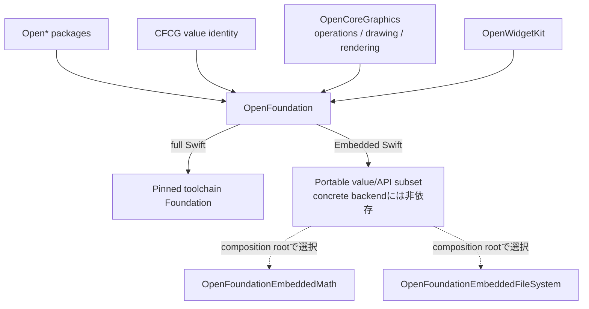

# OpenFoundation

OpenFoundationは、CoreFoundation workspace内の`Open*`パッケージがFoundationを扱うための
共通境界です。Foundation全体をforkするパッケージではなく、full Swiftでは公式Foundationを
再公開し、Embeddedでだけ明示されたportable subsetを実装します。

## Policy

| Swift mode | `OpenFoundation`の動作 | 型identity | Foundation link |
|---|---|---|---|
| macOS / Linux / Windows | toolchain組み込み`Foundation`を再公開 | toolchain Foundationと同一 | あり |
| 通常WASM | Swift SDK組み込み`Foundation`を再公開 | SDK Foundationと同一 | あり |
| Embedded WASM | 必要最小限のportable値実装を提供 | Foundation互換値はOpenFoundation、Swift型は標準library | なし |

通常環境では`Date`、`Data`、`URL`などの代替型を宣言しません。
`@_exported import Foundation`だけを行うため、Windowsを含むfull Swiftでは公式Foundationの
型identityと実装をそのまま使用します。

Embedded SwiftではFoundation module自体をimportまたはlinkしません。現在のportable surfaceは、
既存のOpen系実行経路に必要な`Data`、`URL`、`Date`、`TimeInterval`、CFCG値型、限定的な
`String.Encoding`、plain-string `NSAttributedString`、math関数です。固定Embedded SDKでは
`Swift.AnyHashable`が明示的にunavailableなため、OpenFoundationは現在のOpen系metadata経路に必要な
scalar-key subsetを未完成契約として提供します。

## Ownership

`CGFloat`、`CGPoint`、`CGSize`、`CGRect`、`CGRectEdge`、`CGVector`、`CGAffineTransform`、
`CGAffineTransformComponents`はOpenFoundationが単一の値identityとして所有します。full Swiftでは
toolchain Foundationの宣言をshadow aliasなしで再公開し、非Darwin Foundationで欠ける型だけを
補完します。Embeddedではportable宣言を提供します。OpenCoreGraphicsは同じ型をre-exportし、演算、
path、context、drawing、rendererを所有します。

## FoundationEssentials

`FoundationEssentials`を直接importしません。full Swiftの公開互換境界は`Foundation` umbrellaに
固定し、compiler、Foundation、FoundationEssentials、FoundationInternationalization、runtimeを
同じtoolchain/SDKから取得します。

Embeddedのサイズ削減は`FoundationEssentials`への差し替えではなく、Foundation moduleを依存
グラフから完全に外すことで実現します。実際の削減量は同一toolchain・同一最適化条件のbinary
比較でのみ判断します。2026-08-20に固定したSwift 6.4 snapshotで同じgeometry fixtureをrelease
buildした結果、通常WASMは60,439,915 bytes、Embedded WASMは307,745 bytesでした。Embedded側の
link symbolにFoundationEssentials、FoundationInternationalization、CoreFoundationの実体はなく、
math/file-system backendもgeometry-only graphからは選択されていません。

## Package layout

| Target | Role |
|---|---|
| `OpenFoundation` | full SwiftのFoundation再公開とEmbedded portable value/API。具象backendへ依存しない |
| `OpenFoundationEmbeddedMath` | Embedded math hookのcapability-specific実装 |
| `OpenFoundationEmbeddedFileSystem` | Embedded file read/write hookのcapability-specific実装 |
| `OpenFoundationToolchainIdentity` | Foundationを直接importし、再公開された型との同一性をcompile時に検証するtest helper |
| `OpenFoundationTests` | full Swift再公開とtoolchain Foundation型identityのfixture |
| `OpenFoundationGeometrySmoke` | CFCG値、scalar幅、Foundation非依存をNative/WASM/Embeddedで検証するruntime fixture |
| `OpenFoundationEmbeddedMathSmoke` | math backendだけを選ぶEmbedded compile/link/runtime fixture |
| `OpenFoundationEmbeddedFileSystemSmoke` | file backendだけを選び、URL・encoding・I/O失敗契約まで確認するEmbedded runtime fixture |

通常のconsumerが選ぶ共通productは`OpenFoundation`だけです。Embedded executableは使用する
capabilityに応じて`OpenFoundationEmbeddedMath`または
`OpenFoundationEmbeddedFileSystem`をcomposition rootで追加します。これらを追加しないfull Swiftの
dependency graphへEmbedded backendは入りません。2つのEmbedded smokeはbackendを別々に選び、固定
toolchainとSDKでportable値、URL失敗契約、math、file I/Oの成功・失敗を実行します。

## Status

package source、CFCG値型の単一所有、OpenCoreGraphicsの直接依存、OpenWidgetKitの依存接続を
実装しています。Native、通常WASM、Embedded WASMのCFCG境界に加え、Embeddedのmath、encoding、
URL、file I/O、typed failureは検証済みです。Windowsでのcompile/link/runtimeと、明示したsubsetを
超えるFoundation semantic parityは未検証です。詳細は
[IMPLEMENTATION_PROGRESS.md](IMPLEMENTATION_PROGRESS.md)を参照してください。構造や宣言の存在を
compile/link/runtime互換の証拠として扱ってはいけません。
